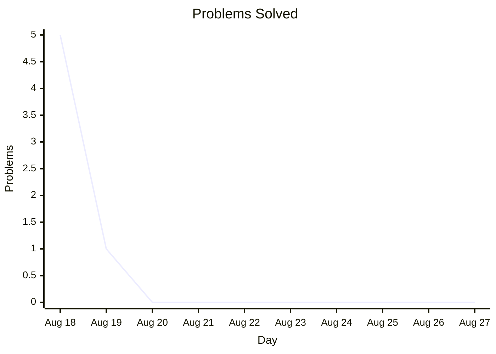

# Australian Informatics Resources
## Notices
Easier way to install orac2.info userscript: [link](https://greasyfork.org/en/scripts/591750-orac-userscript)

DISCLAIMER: None of the 'hidden' or old problems I have in this repository are already public material, which can be accessed from brute-forcing page links, or using the Wayback Machin (old versions of the website)

Website is now live on [github pages](https://aperson31415.github.io/informatics/) (just a fancier file explorer tho, adding other stuff soon)

## Actual Content

ORAC Solutions to AIO problems, AIIO Problems, Alpha Contest Problems, FARIO Problems, Other ORAC Problems. By the way, if a problem file is just a number, it refers to [https://orac2.info/problem/id/](https://orac2.info/problem/id/). Also, I will not include solutions to questions that are not available to the public.

I'm planning to solve a lot of problems (specifically AIO + AIIO) soon. (Aiming for 5 stars and below full solve), and solving a few easy FARIO cuz I haven't solved any right now for some reason.

Somehow this repo has an average of ~150-200 unique cloners every fortnight but like 5 views, so is that just bots or real people? Someone pls tell me.

## Solves

  
Test of graph/table of my solves right before AIO

  
  | Type of Problem | Amount |
| AIO   | 4   |
| AIIO   | 2   |
| Other | 0 |

Problems I've solved: 172

100 Problems: Jan 2026 
125 Problems: Mar 2026 
150 Problems: Apr 2026 
All AIO p1-5s: Sep 2026 
All 3 star problems: Apr 2026, Tennis Robot II got added recently, so Sep 2026 

All AIO problems: ? 
All Alpha p1-3s: ? 
175 problems solved: ? 
All 4 star problems: ? 
500+ in this years AIO!: ? 

## ORAC Userscript
A tool located in the top folder of this repository which, as injected as a userscript, shows some old, hidden orac2.info problems, organises problems better, and allows you to mark problems with your own tags.

Now, it comes with editorials for problems (most not added, but slowly and surely they will). However, you need to do 'something' in order to enable the showing of these editorials, to make sure that you have actually tried to solve the problem.

I've also added some old problems which _most_ users can't access now, but given the pdfs/old html stuff (i can only use stuff used from other online sources wayback machine otherwise i could get in trouble). Note that the style is very different, so womp womp kinda.

Also, there are some very brief and kinda unreadable editorials in the form of notes that i got from my tampermonkey, called editorial_data.json or smth like that. I recommend importing it immediately before u get solving bcuz otherwise if u re-import, then it might corrupt your other data like custom sets (working on tool to combine without clashes like this). To do it, enable developer mode or advanced mode (forgot), then reload everything a bunch, then click on the 'storage' tab when editing the userscript.

## Advanced AIO Tutorials
This is a project being worked on right now, to cover some advanced AIO problems, and topics needed to solve them. This also extends into AIIO problems and topics. I hope to also make  a userscript to integrate this into orac2.info.

## CP Notes (kactl.pdf, new is pterodactyl)
CP notes which were originally for AIO, but made too long and with too many advanced topics.
I've found that these notes are good for solving alpha/aiio problems.

Closer to AIO, I might make some notes more focused on aio, and some common tricks, and ideas that have come up in past p4-6s.
Also, there is a version with no code highlighting for printing.

## yes
If anyone from AMT doesn't like this, just email me at [acoder31415@gmail.com](mailto:acoder31415@gmail.com). (like aiio 2020)
